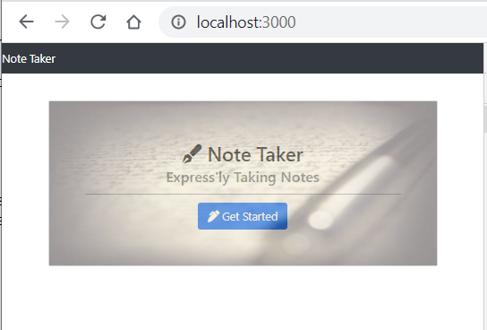
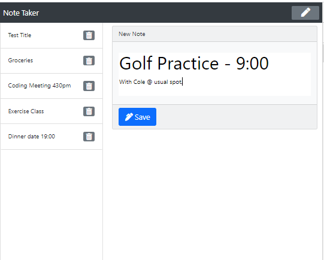

# Project Title: NoteTaker

## Description: 
    Notetaker for the busy individual who needs to keep track of everything. The application can be used to write and save notes using express.
    

## Installation:
   -Node.js is required
   -Npm install is required to install required npm packages

 ## Usage:
    To start using the application, open your browser and go to

    http://localhost:3000/  

 ## Contributing:
    Contributions made by Jordan Mossing using various technolgies.

 ## Screenshots:

 # 

 # 

 ## Questions:
 
    Reach out to me on my GitHub page at the following:

    -[GitHub Profile](https://github.com/jmo1point0)     

    Or by email: jordan.mossing@gmail.com

## Link to Note Taker Deployed in Heroku:

## [Heroku Link](https://note-taker-jordan.herokuapp.com/)

 
 

 

